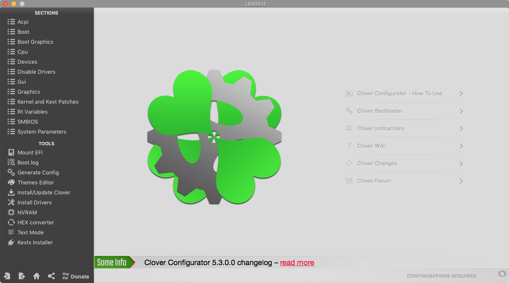

# Configuring Clover

Download the latest Clover Configurator app from [here](https://mackie100projects.altervista.org/download-clover-configurator/).

Once you've got Clover installed and Clover Configurator opened go ahead and click on the Mount EFI tab on the left of the app. Now find the drive you've got macOS on and click on Mount Partition then Open Partition.  
Now open `EFI > CLOVER` and right click on config.plist and open with Clover Configurator.

Now your config is open. This is the file that tells Clover what to apply to your system when booting.

