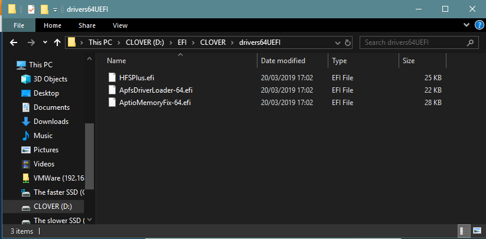

# Setting up Clover for AMD Vanilla

To begin with you'll need the example config from the AMD Vanilla GitHub repo for your CPU architecture, Zen or 15h/16h.

Once downloaded simply copy the config.plist file onto the CLOVER drive you'll now see in This PC.  
The full directory you should be in is,

```text
CLOVER -> EFI -> CLOVER
```


Browse to CLOVER_/EFI/CLOVER_  and go to the _drivers64UEFI_ folder and delete everything that is inside it. Go to Drivers-off/drivers64UEFI and copy the following files to /EFI/Clover/drivers64UEFI:



Now to enable some hardware support...


```text
Note that a working internet connection is required for this method. You'll find kexts to enable the hardware in the next step. LAN is recommended.
```


